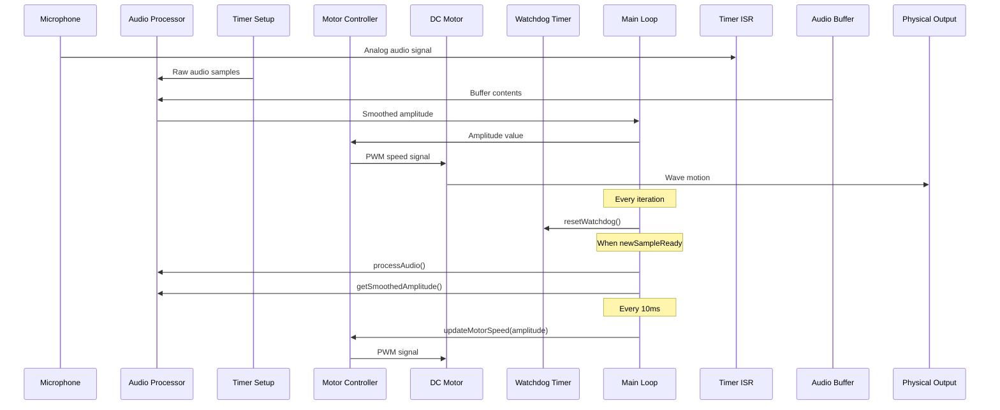

# System Architecture Diagrams

## Flowchart Diagram

```mermaid
graph TB
    %% Real-Time Audio Wave Visualization

    %% Components
    microphone([Microphone])
    style microphone fill:#e1f5ff,stroke:#01579b,stroke-width:2px,color:#000
    audio_processor[Audio Processor]
    style audio_processor fill:#fff3e0,stroke:#e65100,stroke-width:2px,color:#000
    timer_setup[Timer Setup]
    style timer_setup fill:#fff3e0,stroke:#e65100,stroke-width:2px,color:#000
    motor_controller[Motor Controller]
    style motor_controller fill:#fff3e0,stroke:#e65100,stroke-width:2px,color:#000
    dc_motor([DC Motor])
    style dc_motor fill:#e1f5ff,stroke:#01579b,stroke-width:2px,color:#000
    watchdog_timer[Watchdog Timer]
    style watchdog_timer fill:#fff3e0,stroke:#e65100,stroke-width:2px,color:#000

    %% Data Flow
    microphone -->|Analog audio signal - Timer interrupt (1kHz)| timer_setup
    timer_setup -->|Raw audio samples| audio_processor
    audio_processor -->|Smoothed amplitude| main_loop
    main_loop -->|Amplitude value| motor_controller
    motor_controller -->|PWM speed signal| dc_motor
    dc_motor -->|Wave motion| physical_output

    %% Main Loop Flow
    main_loop[Main Loop]
    style main_loop fill:#f3e5f5,stroke:#4a148c,stroke-width:2px,color:#000
    main_loop -->|processAudio| audio_processor
    main_loop -->|updateMotorSpeed| motor_controller
    main_loop -->|resetWatchdog| watchdog_timer

    %% Physical Output
    physical_output([Physical Wave Motion])
    style physical_output fill:#c8e6c9,stroke:#1b5e20,stroke-width:2px,color:#000
    dc_motor --> physical_output

    %% Interrupt Flow
    timer_setup -.->|ISR triggers| audio_processor
    style timer_setup stroke-dasharray: 5 5

```

## Sequence Diagram


